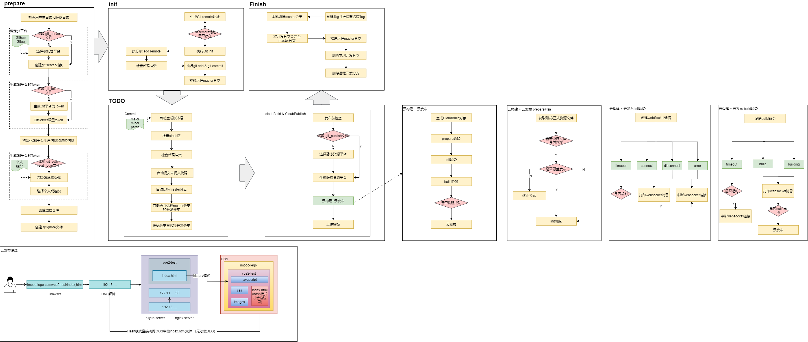

# ak-cli

ak-cli 工具

### init 命令

```
ak-cli init --targetPath /Users/ak/Desktop/project/ak-cli/commands/init --force --debug test-project
```

### 提交规范

1. commitizen
2. cz-conventional-changelog (Commitizen 适配器)
3. conventional-changelog-cli (自动生成 CHANGELOG 文件)

- 一般通过 git cz 提交符合规范的 commit 信息，但是有些开发者不是通过命令行的方式来提交 commit 的。如果我们需要强制校验 vscode/webstorm 等其他工具的方式提交 commit，可以使用 commitlint+husky 的方式来配合使用。

3. @commitlint/cli (校验提交说明是否符合规范)
4. @commitlint/config-conventional (安装符合 Angular 风格的校验规则)
5. husky (git 钩子工具)

[commit 参考文献](https://godbasin.github.io/2019/11/10/change-log/)

### 发布的整体架构图


